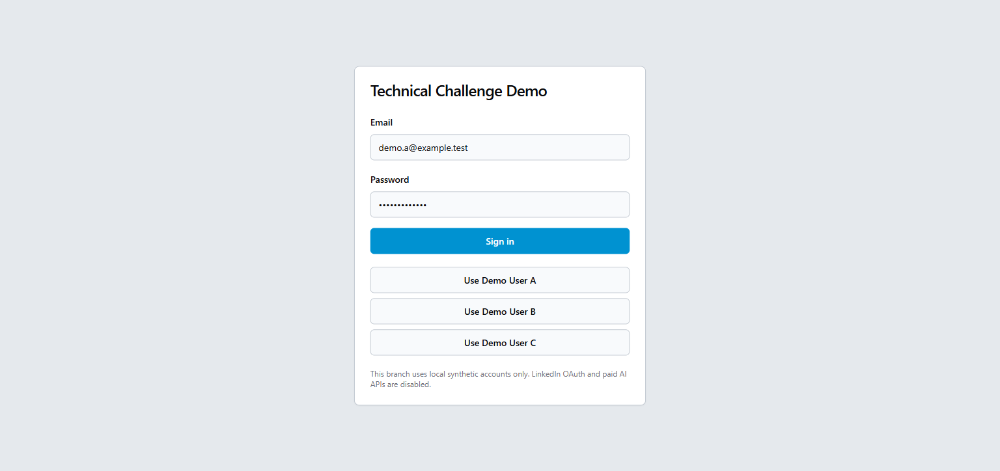
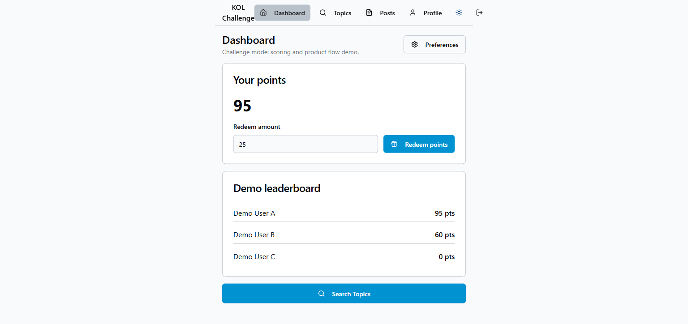
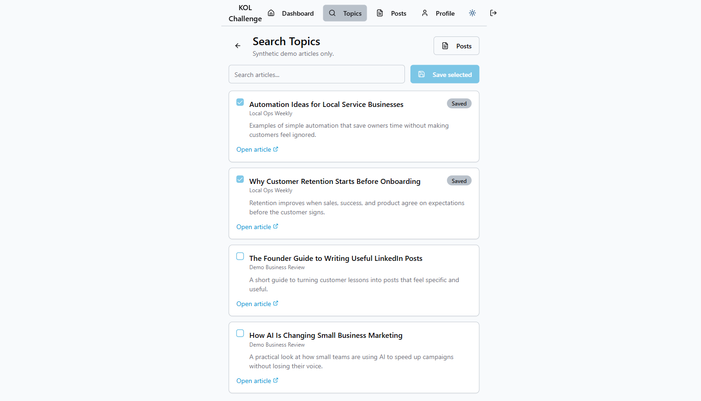
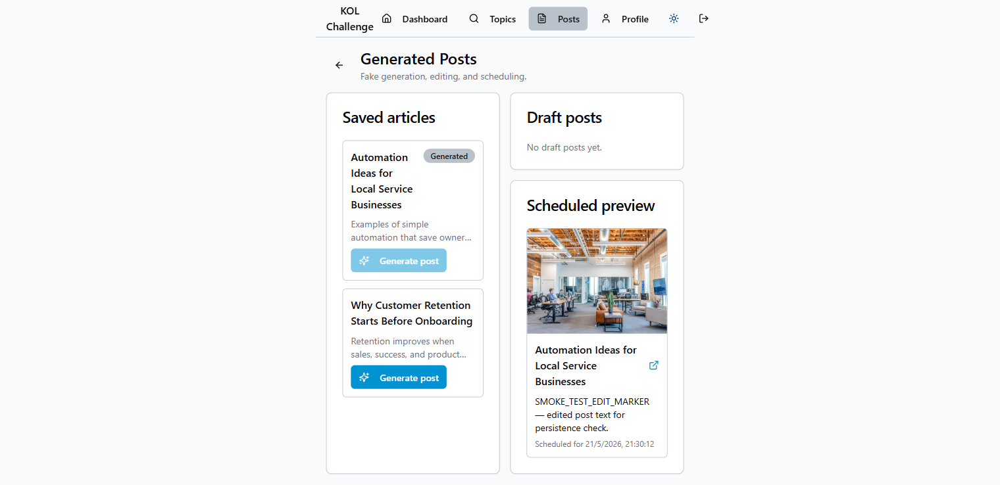
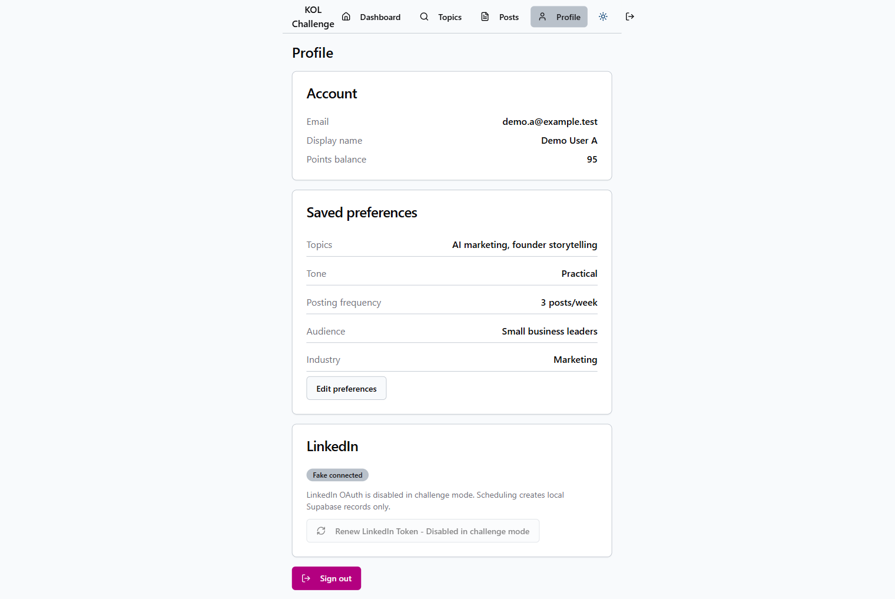

<div align="center">

# KOL — Reto Tecnico Castleberry Media

**Plataforma de contenido para lideres de negocio**  
Descubri articulos, genera posts para LinkedIn con IA simulada y gestiona tu calendario editorial.

[](.)
[](./SOLUTION.md)
[](./SOLUTION.md)
[](.)
[](.)

</div>

---

## Capturas de pantalla

| Login | Dashboard |
|---|---|
|  |  |

| Busqueda de topicos | Posts generados |
|---|---|
|  |  |

<div align="center">

**Perfil de usuario**



</div>

---

## Que se hizo en este reto

Este repositorio es la solucion al reto tecnico de Castleberry Media. La tarea fue identificar, corregir y documentar bugs intencionales en una aplicacion React + Supabase que simula el producto KOL.

Se encontraron y corrigieron **6 bugs** que afectaban areas criticas del producto: logica de puntos, visualizacion de datos, persistencia, politicas de seguridad en Supabase y onboarding de usuarios.

Cada bug tiene su propio issue y PR en GitHub con el razonamiento detras del fix. Ver [SOLUTION.md](./SOLUTION.md) para la documentacion completa en español.

---

## Bugs encontrados y corregidos

| # | Area | Severidad | Descripcion breve |
|---|---|---|---|
| 1 | Visualizacion de articulos | 🔴 Alta | `brokenExtractTitle()` ignoraba el articulo y retornaba "Article 1", "Article 2" en lugar del titulo real |
| 2 | Logica de puntos | 🔴 Alta | `redeemPoints()` descontaba del lider del leaderboard, no del usuario autenticado |
| 3 | Persistencia de posts | 🟡 Media | `saveEdit()` mostraba toast de exito pero nunca llamaba a Supabase `update` |
| 4 | Preview de posts programados | 🟡 Media | Leia `image_url` (con guion bajo) pero la columna en DB se llama `imageurl` — imagen siempre en blanco |
| 5 | Onboarding | 🟡 Media | `upsert` sobreescribia `display_name` con el prefijo del email en cada guardado |
| 6 | RLS / Leaderboard | 🟠 RLS | Politica SELECT en `profiles` con `auth.uid() = id` bloqueaba filas ajenas — leaderboard mostraba solo 1 fila |

---

## Flujo principal (verificado)

```
Login → Dashboard → Search Topics → Guardar articulos
     → Generar post (Edge Function) → Editar → Programar
     → Preview con imagen → Perfil → Logout
```

Todos los pasos verificados manualmente en el navegador con los tres usuarios de prueba.

---

## Stack

| Capa | Tecnologia |
|---|---|
| Frontend | React 18, TypeScript 5.5, Vite 5 (SWC) |
| UI | shadcn/ui (Radix UI), Tailwind CSS 3.4 |
| Routing | React Router 6 |
| Backend | Supabase (PostgreSQL + Auth + RLS + Edge Functions) |
| Runtime Edge | Deno (supabase/functions) |

---

## Requisitos previos

- [Node.js](https://nodejs.org/) con npm
- [Docker Desktop](https://www.docker.com/products/docker-desktop/) (debe estar corriendo antes de usar Supabase)
- [Supabase CLI](https://supabase.com/docs/guides/cli)
- Git

---

## Como correr en local

### 1. Instalar dependencias

```powershell
npm install
```

### 2. Configurar variables de entorno

```powershell
Copy-Item .env.example .env.local
```

### 3. Iniciar Supabase

```powershell
supabase start
```

Copia la clave `anon key` que imprime el comando y pegala en `.env.local`:

```env
VITE_SUPABASE_URL=http://127.0.0.1:54321
VITE_SUPABASE_ANON_KEY=<pegar aqui la anon key>
```

### 4. Cargar datos de prueba

```powershell
supabase db reset
```

### 5. Iniciar Edge Functions (terminal separada)

```powershell
supabase functions serve
```

### 6. Iniciar la aplicacion

```powershell
npm run dev
```

Si PowerShell bloquea `npm`:

```powershell
npm.cmd run dev
```

La aplicacion corre en **`http://localhost:8080`** (no en el puerto 5173 por defecto de Vite — el puerto esta configurado en `vite.config.ts`).

---

## URLs locales

| Servicio | URL |
|---|---|
| Aplicacion | `http://localhost:8080` |
| Supabase API | `http://127.0.0.1:54321` |
| Supabase Studio | `http://127.0.0.1:54323` |

---

## Usuarios de prueba

| Email | Password | Puntos iniciales |
|---|---|---|
| `demo.a@example.test` | `Challenge123!` | 120 |
| `demo.b@example.test` | `Challenge123!` | 60 |
| `demo.c@example.test` | `Challenge123!` | 0 |

Ejecutar `supabase db reset` para restaurar los datos originales en cualquier momento.

---

## Datos sinteticos

La base de datos se carga desde `supabase/seed.sql`. Incluye usuarios, perfiles, fuentes de articulos, articulos y puntos. Todas las integraciones (LinkedIn, generacion de IA) son simuladas.

- La Edge Function `generate-posts` construye el texto del post desde el contenido del articulo sin llamar a ningun API externo.
- El flujo de programacion guarda el estado solo en Supabase local.
- LinkedIn login retorna `{ success: false }` de forma intencional.

---

## Seguridad

Antes de revisar el repositorio, se verifico:

- Sin archivos `.env` commiteados
- Sin URL de Supabase productivo
- Sin `service_role` key en el codigo
- Sin credenciales reales de LinkedIn ni APIs de pago
- Sin datos reales de usuarios o clientes

---

## Documentacion de la solucion

Ver [SOLUTION.md](./SOLUTION.md) para la descripcion completa en español de:

- Que se identifico en cada bug
- Que cambios se realizaron y por que
- Como se probo el flujo completo
- Que mejorarias adicionales se harian con mas tiempo
